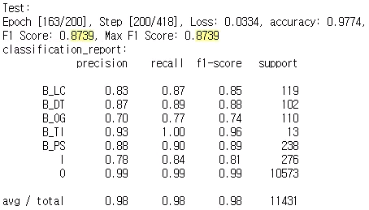
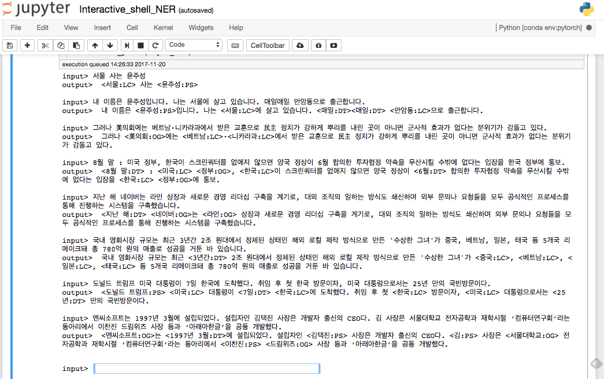
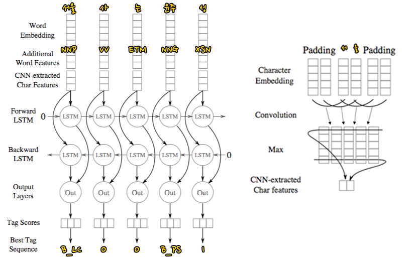

# CNN-BiLSTM model for Korean NER
CNN과 BiLSTM을 이용한 한국어 객체명 인식기입니다.

#### 사용한 자질은 다음과 같습니다.
- 형태소 non-static word2vec, static word2vec (mecab 사용, gensim으로 word2vec)
- 음절단위 (character cnn)
- POS (mecab 사용)
- 사전정보 (gazette)

#### Requirements
- ```pytorch```
- ```konlpy, mecab```
- ```gensim```

#### 성능


#### 결과 예제


#### 모델
  

#### Future work
- CRF + Viterbi
